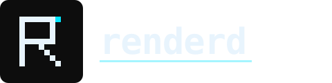

<p align="center">
  
</p>

<p align="center">
  <strong>High-performance, peer-to-peer macOS host to Windows 10+ display streaming daemon built in Rust.</strong>
</p>

<p align="center">
  <a href="https://github.com/Ad1th/renderd/actions/workflows/ci.yml"></a>
  <a href="https://opensource.org/licenses/MIT"></a>
  <a href="https://www.rust-lang.org"></a>
  <a href="assets/brand/BRAND.md"></a>
</p>

---

`Renderd` is an open-source, ultra-low-latency peer-to-peer display streaming system designed specifically for using a Windows PC (Windows 10 or later) as a secondary high-refresh-rate desktop display for a macOS host workstation. Operating directly over QUIC/UDP with hardware-accelerated video pipelines (`ScreenCaptureKit` and `VideoToolbox` on macOS; `Direct3D12` and `MediaFoundation` on Windows), `Renderd` delivers sub-16ms latency display mirroring without cloud relays or intermediary servers.

> [!NOTE]
> `Renderd` is currently in active pre-release development (**all 8 milestones complete**). The complete architecture is implemented and tested: protocol schemas, configuration engine, frame reassembly pipeline, presentation clock, ABR controller, crypto primitives, ScreenCaptureKit/VideoToolbox host capture FFI, QUIC transport, platform keychains, mDNS discovery, the `renderd-host` macOS daemon (with full subsystem initialization, session state machine, menu bar UI, and persistent SIGINT/SIGTERM run loop), and the `renderd-viewer` Windows application (winit event loop, D3D12 renderer, D3D12 video decoder, datagram reassembly, vsync reporter, dual-timescale ABR feedback, SPAKE2+ pairing UI, reconnect watchdog, status overlay, system tray icon, and CI release packaging). All 136 workspace tests pass.

---

## Why Renderd Exists

Software display extensions between macOS and Windows endpoints have historically suffered from fundamental latency, image quality, and architecture compromises:

1. **Proprietary Relays & Subscription Paywalls:** Most commercial cross-platform display applications route video frames through remote cloud servers or require subscription services.
2. **High Latency & Frame Stutter:** Protocols built on top of WebRTC or TCP struggle with jitter control and frame pacing on high-refresh-rate displays (120Hz/144Hz).
3. **Lack of macOS Host → Windows Viewer Synergy:** Existing open-source tools (like Sunshine/Moonlight) are optimized primarily for Windows hosts streaming to client devices. There is no dedicated, lightweight daemon for a macOS host streaming to a Windows 10 or later viewer.

`Renderd` solves this by pairing Apple's zero-copy `ScreenCaptureKit` and `VideoToolbox` hardware encoder directly with Windows' low-overhead `Direct3D12` / `MediaFoundation` decoder over a custom QUIC transport layer.

---

## Comparison Matrix

| Feature / Metric | Apple Sidecar | Luna Display | Sunshine / Moonlight | DeskIn / Duet | **Renderd** |
|---|---|---|---|---|---|
| **Host Support** | macOS | macOS / Windows | Windows / Linux | macOS / Windows | **macOS 13+ (Apple Silicon)** |
| **Viewer Support** | iPadOS only | iPadOS / Mac / Win | Multi-platform | Multi-platform | **Windows 10+ (x86_64 / ARM64)** |
| **Protocol Transport** | Proprietary AWDL | Proprietary Wi-Fi/USB | WebRTC / Custom UDP | Cloud Relay / TCP | **QUIC Datagrams / UDP** |
| **Hardware Video Pipeline** | AVFoundation | Custom Dongle | NVENC / AMF / VAAPI | Software / HW hybrid | **ScreenCaptureKit → D3D12** |
| **Vsync Phase Sync** | ❌ No | ❌ No | ❌ No | ❌ No | **✅ Yes (~16.7ms phase alignment)** |
| **Cloud Dependency** | iCloud Auth | None | None | Cloud Account | **Zero (100% Peer-to-Peer)** |
| **Open Source** | ❌ No | ❌ No | ✅ Yes | ❌ No | **✅ Yes (MIT License)** |

---

## Architecture Overview

`Renderd` separates control plane signaling (QUIC Stream 0 with Protobuf framing) from data plane frame delivery (QUIC Datagrams with 16-byte fixed headers).

```mermaid
flowchart LR
    subgraph macOS Host ["macOS Host (Renderd Host Daemon)"]
        SCK["ScreenCaptureKit\n(Zero-Copy Frame Capture)"] --> VT["VideoToolbox\n(HEVC / H.264 HW Encoder)"]
        VT --> FRAG["Frame Fragmenter\n(Sliding-Window Datagrams)"]
        FRAG --> QUIC_H["QUIC Engine (quinn)\n(Stream 0 Control + Datagrams)"]
    end

    subgraph Transport ["Network Layer (Peer-to-Peer UDP)"]
        QUIC_H <== "Control Envelopes (Proto3)" ==> QUIC_V["QUIC Engine (quinn)"]
        QUIC_H -. "Sub-16ms Video Datagrams" .-> QUIC_V
    end

    subgraph Windows Viewer ["Windows 10+ Viewer (Renderd Viewer Client)"]
        QUIC_V --> REASS["Fragment Reassembler\n(Sliding-Window, W=4 Frames)"]
        REASS --> MF["MediaFoundation\n(Hardware Video Decoder)"]
        MF --> D3D12["Direct3D12 Renderer\n(Zero-Copy Swapchain Present)"]
    end
```



### Protocol Layering

```
┌──────────────────────────────────────────────────────────────────┐
│  Stream 0 (Control Plane): [u32 length][Protobuf Envelope]       │
├──────────────────────────────────────────────────────────────────┤
│  Datagrams (Data Plane):   [16-byte Fragment Header][Payload]   │
└──────────────────────────────────────────────────────────────────┘
```

---

## Key Features

- **`renderd-proto`:** Shared Protobuf definitions, envelope validation, and domain newtypes (`FrameId`, `FragmentId`, `BitrateKbps`).
- **`renderd-config`:** Layered configuration loader with TOML template defaults, environment variable overrides (`RENDERD_*`), and CLI flag parsing.
- **`renderd-frame`:** Low-overhead 16-byte fragment header codec and out-of-order sliding-window reassembly state machine.
- **`renderd-clock`:** Presentation clock estimation, rolling network statistics, and monotonic instant tracking for vsync phase alignment.
- **`renderd-abr`:** Adaptive Bitrate control algorithm with AIMD state transitions, panic state keyframe requests, and bandwidth probing.
- **`renderd-crypto`:** SPAKE2+ P-256 key exchange (RFC 9382), HKDF-SHA256 key derivation, and TLS 1.3 certificate generation.
- **`renderd-vt-sys`:** Safe C/FFI bindings to Apple's `VideoToolbox` framework for hardware video encoding.
- **`renderd-sc-sys`:** Safe C/FFI bindings to Apple's `ScreenCaptureKit` framework for zero-copy GPU frame capture.
- **`renderd-net`:** QUIC transport engine (`QuicServer` / `QuicClient`), 4-byte length-prefixed control stream framing, non-yielding datagram burst sender, and smooth path RTT telemetry exporter.
- **`renderd-keychain`:** Platform-agnostic `KeychainStore` interface with macOS Keychain Services (`kSecClassGenericPassword`), Windows Credential Manager (`CredWriteW`/`CredReadW`), and headless mock stores.
- **`renderd-discovery`:** mDNS peer discovery with macOS Bonjour (`dns_sd.h`), Windows Win32 mDNS (`DnsServiceRegister`/`DnsServiceBrowse`), and static IP resolution fallbacks.
- **`renderd-host`:** macOS host daemon orchestrating all subsystems via `HostApp::run()`: `CapturePipeline` (zero-copy ScreenCaptureKit frames), `EncodePipeline` (VideoToolbox HEVC hardware encoder with SPSC ring buffer), `ClockController` (vsync pacing from `VsyncReport`), `AbrManager` (dual-timescale bitrate decisions), `HostSession` (`IDLE → PAIRING → CONNECTED → STREAMING` state machine), `NetworkManager`, and `UiManager` (macOS menu bar and user notifications). Runs persistently via SIGINT/SIGTERM signal handler.
- **`renderd-viewer`:** Windows viewer display application featuring native `winit` event loop management, Per-Monitor v2 DPI awareness, D3D12 swap chain and YUV-to-RGB shader renderer, `ID3D12VideoDecoder` hardware video decoder, datagram receiver and sliding-window reassembly task, DWM vsync phase reporter (`VsyncReport` via QUIC Stream 0), dual-timescale ABR feedback exporter (`ReactiveStats` at 100 ms / `PeriodicStats` at 500 ms), SPAKE2+ prover pairing UI with PIN entry, reconnect watchdog with mDNS re-discovery, semi-transparent "Reconnecting" status overlay, Windows system tray icon via `Shell_NotifyIcon`, and CI release packaging workflow.

---

## Repository Layout

```text
renderd/
├── Cargo.toml                  # Workspace root manifest (16 member crates)
├── rust-toolchain.toml         # Rust toolchain pinning (MSRV 1.80+)
├── clippy.toml                 # Workspace Clippy lint rules
├── .rustfmt.toml               # Code formatting rules
├── deny.toml                   # Security audit & license policies (cargo-deny)
├── nextest.toml                # Test runner configuration (cargo-nextest)
├── proto/
│   └── renderd.proto           # Control plane Protobuf schema
├── templates/
│   ├── renderd-host.default.toml   # Canonical macOS host daemon configuration
│   └── renderd-viewer.default.toml # Canonical Windows viewer configuration
├── tools/
│   ├── proto-gen/              # Code generator tool compiling renderd.proto → Rust
│   ├── latency-bench/          # Frame capture & network round-trip benchmark CLI
│   └── bundle-host/            # Assembles and signs the macOS .app bundle
├── crates/
│   ├── renderd-proto/          # Protobuf types, newtypes, and envelope validation
│   ├── renderd-config/         # Layered config loader, schemas, and validators
│   ├── renderd-frame/          # Fragment header codec & reassembly state machine
│   ├── renderd-clock/          # Presentation clock synchronization (vsync phase)
│   ├── renderd-abr/            # Adaptive Bitrate control algorithm
│   ├── renderd-crypto/         # SPAKE2+ (RFC 9382), HKDF key derivation, TLS certs
│   ├── renderd-vt-sys/         # VideoToolbox hardware encoder FFI bindings
│   ├── renderd-sc-sys/         # ScreenCaptureKit capture FFI bindings
│   ├── renderd-net/            # QUIC socket transport, framing & datagram pipeline
│   ├── renderd-keychain/       # macOS Keychain & Windows Credential Manager
│   ├── renderd-discovery/      # mDNS / Bonjour peer discovery
│   ├── renderd-host/           # macOS Host daemon executable binary
│   └── renderd-viewer/         # Windows Viewer display client architecture
└── docs/                       # Specifications and architecture docs
```

---

## Roadmap & Implementation Status

`Renderd` is executing across an engineering roadmap defined in [`ISSUES-0001-milestones.md`](docs/ISSUES-0001-milestones.md) (Milestones 1–8) and [`ISSUES-0002-integration.md`](docs/ISSUES-0002-integration.md) (Milestone 9).

- [x] **Milestone 1: Repository Bootstrap & Infrastructure** (`v0.1.0-bootstrap`)
- [x] **Milestone 2: Foundation Layer** (`v0.2.0-foundation`)
- [x] **Milestone 3: Primitive Layer (Frame & Crypto)** (`v0.3.0-primitives`)
- [x] **Milestone 4: FFI Layer (VideoToolbox & ScreenCaptureKit)** (`v0.4.0-ffi`)
- [x] **Milestone 5: Service Layer (Net, Keychain & Discovery)** (`v0.5.0-services`)
- [x] **Milestone 6: Algorithm Layer (ABR & Clock Sync)** (`v0.6.0-algorithms`)
- [x] **Milestone 7: Host Application (`renderd-host`)** (`v0.7.0-host`)
- [x] **Milestone 8: Viewer Application (`renderd-viewer`)** (`v0.8.0-viewer`)
- [ ] **Milestone 9: End-to-End Integration & System Validation** (`v0.9.0-integration`)

---

## Supported Platforms

| Component | Operating System | Target Architecture |
|---|---|---|
| **Renderd Host Daemon** | macOS 13.0+ (Ventura / Sonoma / Sequoia) | `aarch64-apple-darwin` (Apple Silicon) |
| **Renderd Viewer Client** | Windows 10 or later (primary); Windows 11 supported | `x86_64-pc-windows-msvc`, `aarch64-pc-windows-msvc` |

---

## Continuous Integration (CI)

Our GitHub Actions CI pipeline validates every commit across **Linux** (`ubuntu-latest`), **macOS** (`macos-15`), and **Windows** (`windows-2025`) using:

- **Formatting Check:** `cargo fmt --check`
- **Linting:** `cargo clippy --workspace --all-targets -- -D warnings`
- **Test Suite:** `cargo nextest run --profile ci`
- **Protocol Validation:** `proto-check` verifying `renderd.proto` codegen sync
- **Spell Check:** `typos` checking codebase spelling integrity

---

## Build Instructions & Development Setup

### Prerequisites

- **Rust:** Stable toolchain 1.80+ (`rustup toolchain install stable`)
- **macOS (Host Development):** Xcode Command Line Tools (`xcode-select --install`)
- **Windows (Viewer Development):** Visual Studio 2022 C++ Workload (Windows 10 / 11 SDK)

### Building the Workspace

```bash
# Clone repository
git clone https://github.com/Ad1th/renderd.git
cd renderd

# Check workspace compilation across all targets
cargo check --workspace

# Run code generator tool for Protobuf types
cargo run --manifest-path tools/proto-gen/Cargo.toml

# Build release binaries
cargo build --workspace --release
```

### Running Verification & Tests

```bash
# Code formatting check
cargo fmt --check

# Strict workspace Clippy lints
cargo clippy --workspace --all-targets -- -D warnings

# Execute test suite (preferred: cargo-nextest)
cargo nextest run --workspace

# Fallback if cargo-nextest is not installed
cargo test --workspace
```

### Running the Applications

```bash
# Run the macOS host daemon (blocks and runs event loop until Ctrl+C)
cargo run -p renderd-host

# Run the Windows viewer application (launches window and renderer)
cargo run -p renderd-viewer
```

---

## Documentation Index

- [RFC-0002: System Architecture Specification](docs/RFC-0002-architecture.md) — Comprehensive technical architecture, control/data plane specs, and security design.
- [REPO-0001: Engineering & Repository Guidelines](docs/REPO-0001-repository.md) — Coding standards, DAG dependencies, crate boundaries, and CI rules.
- [ISSUES-0001: Milestones 1–8 Component Roadmap](docs/ISSUES-0001-milestones.md) — 100-issue breakdown covering component implementation across Milestones 1–8.
- [ISSUES-0002: Milestone 9 Integration & Validation Roadmap](docs/ISSUES-0002-integration.md) — 18-issue breakdown for end-to-end integration and system validation.
- [BRAND.md](assets/brand/BRAND.md) — Renderd visual identity specification, design system, colors, and typography guidelines.
- [CHANGELOG.md](CHANGELOG.md) — Detailed version history adhering to Keep a Changelog standards.
- [CONTRIBUTING.md](CONTRIBUTING.md) — Quick-start guide for contributors.

---

## Contributing

Contributions are welcome! Please read [`CONTRIBUTING.md`](CONTRIBUTING.md) for the quick-start guide and [`docs/REPO-0001-repository.md`](docs/REPO-0001-repository.md) for the complete engineering standards before submitting code.

1. Ensure all code passes `cargo fmt`, `cargo clippy --workspace --all-targets -- -D warnings`, and `cargo nextest run`.
2. Follow Conventional Commits format (`feat(...)`, `fix(...)`, `ci(...)`, `docs(...)`).
3. Check [`CODEOWNERS`](.github/CODEOWNERS) for domain-specific review routing.
4. See §21 of REPO-0001 for the full pull request checklist and what not to contribute.

---

## License

Distributed under the MIT License. See [`LICENSE`](LICENSE) for details.

---

## Acknowledgements

- [Prost](https://github.com/tokio-rs/prost) for Protocol Buffer codegen.
- [Quinn](https://github.com/quinn-rs/quinn) for QUIC transport implementation.
- [Figment](https://github.com/SergioBenitez/Figment) for layered configuration parsing.
