# Renderd

[](https://github.com/Ad1th/renderd/actions/workflows/ci.yml)
[](https://opensource.org/licenses/MIT)
[](https://www.rust-lang.org)
[](https://blog.rust-lang.org)
[](#current-implementation-status)

> **High-performance, peer-to-peer macOS host to Windows 11 display streaming daemon built in Rust.**

`Renderd` is an open-source, ultra-low-latency peer-to-peer display streaming system designed specifically for using a Windows 11 PC as a secondary high-refresh-rate desktop display for a macOS host workstation. Operating directly over QUIC/UDP with hardware-accelerated video pipelines (`ScreenCaptureKit` and `VideoToolbox` on macOS; `Direct3D12` and `MediaFoundation` on Windows), `Renderd` delivers sub-16ms latency display mirroring without cloud relays or intermediary servers.

> [!NOTE]
> `Renderd` is currently in active pre-release development (**Milestone 2 complete**). Core infrastructure, protocol schemas, and configuration engines are established; streaming data plane pipelines are under active construction.

---

## Why Renderd Exists

Software display extensions between macOS and Windows endpoints have historically suffered from fundamental latency, image quality, and architecture compromises:

1. **Proprietary Relays & Subscription Paywalls:** Most commercial cross-platform display applications route video frames through remote cloud servers or require subscription services.
2. **High Latency & Frame Stutter:** Protocols built on top of WebRTC or TCP struggle with jitter control and frame pacing on high-refresh-rate displays (120Hz/144Hz).
3. **Lack of macOS Host → Windows Viewer Synergy:** Existing open-source tools (like Sunshine/Moonlight) are optimized primarily for Windows hosts streaming to client devices. There is no dedicated, lightweight daemon for a macOS host streaming to a Windows 11 viewer.

`Renderd` solves this by pairing Apple's zero-copy `ScreenCaptureKit` and `VideoToolbox` hardware encoder directly with Windows 11's low-overhead `Direct3D12` / `MediaFoundation` decoder over a custom QUIC transport layer.

---

## Comparison Matrix

| Feature / Metric | Apple Sidecar | Luna Display | Sunshine / Moonlight | DeskIn / Duet | **Renderd** |
|---|---|---|---|---|---|
| **Host Support** | macOS | macOS / Windows | Windows / Linux | macOS / Windows | **macOS 14+** |
| **Viewer Support** | iPadOS only | iPadOS / Mac / Win | Multi-platform | Multi-platform | **Windows 11 (x64/ARM64)** |
| **Protocol Transport** | Proprietary AWDL | Proprietary Wi-Fi/USB | WebRTC / Custom UDP | Cloud Relay / TCP | **QUIC Datagrams / UDP** |
| **Hardware Video Pipeline** | AVFoundation | Custom Dongle | NVENC / AMF / VAAPI | Software / HW hybrid | **ScreenCaptureKit → D3D12** |
| **Vsync Phase Sync** | ❌ No | ❌ No | ❌ No | ❌ No | **✅ Yes (~16.7ms phase alignment)** |
| **Cloud Dependency** | iCloud Auth | None | None | Cloud Account | **Zero (100% Peer-to-Peer)** |
| **Open Source** | ❌ No | ❌ No | ✅ Yes | ❌ No | **✅ Yes (MIT License)** |

---

## Architecture Overview

`Renderd` separates control plane signaling (QUIC Stream 0 with Protobuf framing) from data plane frame delivery (QUIC Datagrams with 16-byte fixed headers).

```mermaid
flowchart LR
    subgraph macOS Host ["macOS Host (Renderd Host Daemon)"]
        SCK["ScreenCaptureKit\n(Zero-Copy Frame Capture)"] --> VT["VideoToolbox\n(HEVC / H.264 HW Encoder)"]
        VT --> FRAG["Frame Fragmenter\n(Sliding-Window Datagrams)"]
        FRAG --> QUIC_H["QUIC Engine (quinn)\n(Stream 0 Control + Datagrams)"]
    end

    subgraph Transport ["Network Layer (Peer-to-Peer UDP)"]
        QUIC_H <== "Control Envelopes (Proto3)" ==> QUIC_V["QUIC Engine (quinn)"]
        QUIC_H -. "Sub-16ms Video Datagrams" .-> QUIC_V
    end

    subgraph Windows Viewer ["Windows 11 Viewer (Renderd Viewer Client)"]
        QUIC_V --> REASS["Fragment Reassembler\n(Out-of-Order Ring Buffer)"]
        REASS --> MF["MediaFoundation\n(Hardware Video Decoder)"]
        MF --> D3D12["Direct3D12 Renderer\n(Zero-Copy Swapchain Present)"]
    end
```



### Protocol Layering

```
┌──────────────────────────────────────────────────────────────────┐
│  Stream 0 (Control Plane): [u32 length][Protobuf Envelope]       │
├──────────────────────────────────────────────────────────────────┤
│  Datagrams (Data Plane):   [16-byte Fragment Header][Payload]   │
└──────────────────────────────────────────────────────────────────┘
```

---

## Key Features

- **Zero-Copy Capture & Present:** Direct IOSurface binding to VideoToolbox on macOS; Direct3D12 swapchain presenting on Windows 11.
- **Adaptive Bitrate (ABR):** Real-time congestion control adjusting encoder bitrate dynamically based on fragment loss rate and arrival jitter.
- **Vsync Phase Synchronization:** Monotonic clock alignment adjusting host frame dispatch to match viewer vertical display refresh intervals.
- **Strongly Typed Protocol Schema:** Shared `renderd-proto` crate providing Protobuf definitions, validation, and domain newtypes (`FrameId`, `FragmentId`, `BitrateKbps`).
- **Layered Configuration:** Flexible settings loaded from defaults, TOML files (`renderd.toml`), `RENDERD_*` environment variables, or CLI flags via Figment.
- **Cross-Platform MSRV:** Pinned Rust 1.80+ supporting `aarch64-apple-darwin`, `x86_64-pc-windows-msvc`, and `aarch64-pc-windows-msvc`.

---

## Repository Layout

```text
renderd/
├── Cargo.toml                  # Workspace root manifest (14 member crates)
├── rust-toolchain.toml         # Rust toolchain pinning (MSRV 1.80+)
├── clippy.toml                 # Workspace Clippy lint rules
├── .rustfmt.toml               # Code formatting rules
├── deny.toml                   # Security audit & license policies (cargo-deny)
├── nextest.toml                # Test runner configuration (cargo-nextest)
├── proto/
│   └── renderd.proto           # Control plane Protobuf schema
├── templates/
│   ├── renderd-host.default.toml   # Canonical macOS host daemon configuration
│   └── renderd-viewer.default.toml # Canonical Windows 11 viewer configuration
├── tools/
│   ├── proto-gen/              # Code generator tool compiling renderd.proto -> Rust
│   └── latency-bench/          # Frame capture & network round-trip benchmark CLI
├── crates/
│   ├── renderd-proto/          # Protobuf types, newtypes, and envelope validation
│   ├── renderd-config/         # Layered config loader, schemas, and validators
│   ├── renderd-frame/          # Fragment header codec & reassembly state machine
│   ├── renderd-crypto/         # Noise Protocol & AES-256-GCM encryption
│   ├── renderd-vt-sys/         # VideoToolbox hardware encoder FFI bindings
│   ├── renderd-sc-sys/         # ScreenCaptureKit capture FFI bindings
│   ├── renderd-net/            # QUIC socket transport & datagram pipeline
│   ├── renderd-keychain/       # macOS Keychain & Windows Credential Manager
│   ├── renderd-discovery/      # mDNS / Bonjour peer discovery
│   ├── renderd-abr/            # Adaptive Bitrate control algorithm
│   ├── renderd-clock/          # High-resolution NTP/PTP clock offset estimator
│   ├── renderd-host/           # macOS Host daemon executable binary
│   └── renderd-viewer/         # Windows 11 Viewer client executable binary
└── docs/                       # Specifications and architecture docs
```

---

## Current Implementation Status

`Renderd` is executing across a 10-milestone engineering roadmap defined in [`ISSUES-0001-milestones.md`](docs/ISSUES-0001-milestones.md).

- [x] **Milestone 1: Repository Bootstrap & Infrastructure** (`v0.1.0-bootstrap`)
- [x] **Milestone 2: Foundation Layer** (Protobuf schema, `renderd-proto`, `renderd-config`)
- [ ] **Milestone 3: Core Data Structures & Utilities** (`renderd-frame`, `renderd-clock`, `renderd-abr`)
- [ ] **Milestone 4: macOS Host Capture Engine** (`renderd-sc-sys`, `renderd-vt-sys`)
- [ ] **Milestone 5: Networking & Transport** (`renderd-net`, `renderd-discovery`, `renderd-crypto`)
- [ ] **Milestone 6: Windows Viewer Engine** (Direct3D12, MediaFoundation decoder)
- [ ] **Milestone 7: Integration & Daemons** (`renderd-host`, `renderd-viewer`)
- [ ] **Milestone 8: Benchmarks & Tooling** (`latency-bench`)
- [ ] **Milestone 9: Documentation & Quality**
- [ ] **Milestone 10: Pre-Release Audit & v0.1.0**

---

## Supported Platforms

| Component | Operating System | Target Architecture |
|---|---|---|
| **Renderd Host Daemon** | macOS 14.0+ (Sonoma / Sequoia) | `aarch64-apple-darwin` (Apple Silicon) |
| **Renderd Viewer Client** | Windows 11 (22H2+) | `x86_64-pc-windows-msvc`, `aarch64-pc-windows-msvc` |

---

## Build Instructions & Development Setup

### Prerequisites

- **Rust:** Stable toolchain 1.80+ (`rustup toolchain install stable`)
- **macOS (Host Development):** Xcode Command Line Tools (`xcode-select --install`)
- **Windows (Viewer Development):** Visual Studio 2022 C++ Workload (Windows 11 SDK)

### Building the Workspace

```bash
# Clone repository
git clone https://github.com/Ad1th/renderd.git
cd renderd

# Check workspace compilation across all targets
cargo check --workspace

# Run code generator tool for Protobuf types
cargo run --manifest-path tools/proto-gen/Cargo.toml

# Build release binaries
cargo build --workspace --release
```

### Running Verification & Tests

```bash
# Code formatting check
cargo fmt --check

# Strict workspace Clippy lints
cargo clippy --workspace --all-targets -- -D warnings

# Execute test suite
cargo test --workspace

# Run cargo-deny dependency & license audit
cargo deny check
```

---

## Documentation Index

- [RFC-0002: System Architecture Specification](docs/RFC-0002-architecture.md) — Comprehensive technical architecture, control/data plane specs, and security design.
- [REPO-0001: Engineering & Repository Guidelines](docs/REPO-0001-repository.md) — Coding standards, DAG dependencies, crate boundaries, and CI rules.
- [ISSUES-0001: 100-Issue Roadmap & Milestones](docs/ISSUES-0001-milestones.md) — Complete milestone breakdown and task tracking.
- [CHANGELOG.md](CHANGELOG.md) — Detailed version history adhering to Keep a Changelog standards.

---

## Contributing

Contributions are welcome! Please read [`docs/REPO-0001-repository.md`](docs/REPO-0001-repository.md) before submitting code.

1. Ensure all code passes `cargo fmt`, `cargo clippy -- -D warnings`, and `cargo test`.
2. Follow Conventional Commits format (`feat(...)`, `fix(...)`, `ci(...)`, `docs(...)`).
3. Check [`CODEOWNERS`](.github/CODEOWNERS) for domain-specific review routing.

---

## License

Distributed under the MIT License. See [`LICENSE`](LICENSE) for details.

---

## Acknowledgements

- [Prost](https://github.com/tokio-rs/prost) for Protocol Buffer codegen.
- [Quinn](https://github.com/quinn-rs/quinn) for QUIC transport implementation.
- [Figment](https://github.com/SergioBenitez/Figment) for layered configuration parsing.
