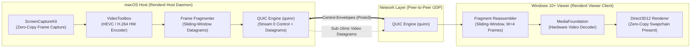

<p align="center">
  
</p>

<p align="center">
  <strong>High-performance, peer-to-peer macOS host to Windows 10+ display streaming daemon built in Rust.</strong>
</p>

<p align="center">
  <a href="https://github.com/Ad1th/renderd/actions/workflows/ci.yml"></a>
  <a href="https://opensource.org/licenses/MIT"></a>
  <a href="https://www.rust-lang.org"></a>
  <a href="assets/brand/BRAND.md"></a>
</p>

---

`Renderd` is an open-source, ultra-low-latency peer-to-peer display streaming system designed specifically for using a Windows PC (Windows 10 or later) as a secondary high-refresh-rate desktop display for a macOS host workstation. Operating directly over QUIC/UDP with hardware-accelerated video pipelines (`ScreenCaptureKit` and `VideoToolbox` on macOS; `Direct3D11` and `MediaFoundation` on Windows), `Renderd` delivers sub-16ms latency display mirroring without cloud relays or intermediary servers.

> [!NOTE]
> `Renderd` streams a macOS desktop to a Windows viewer end to end: zero-copy `ScreenCaptureKit` capture, `VideoToolbox` hardware HEVC/H.264 encoding, QUIC datagram transport with BBR congestion control, in-order reassembly with retransmit-based loss recovery, delay- and loss-aware adaptive bitrate and resolution, and DXVA hardware decode with a zero-copy `Direct3D11` presenter on Windows. Latest release: **`v1.0.0`**, the first stable release. Current focus: pixel-sharp text and fine detail at every resolution step.

---

## Why Renderd Exists

Software display extensions between macOS and Windows endpoints have historically suffered from fundamental latency, image quality, and architecture compromises:

1. **Proprietary Relays & Subscription Paywalls:** Most commercial cross-platform display applications route video frames through remote cloud servers or require subscription services.
2. **High Latency & Frame Stutter:** Protocols built on top of WebRTC or TCP struggle with jitter control and frame pacing on high-refresh-rate displays (120Hz/144Hz).
3. **Lack of macOS Host → Windows Viewer Synergy:** Existing open-source tools (like Sunshine/Moonlight) are optimized primarily for Windows hosts streaming to client devices. There is no dedicated, lightweight daemon for a macOS host streaming to a Windows 10 or later viewer.

`Renderd` solves this by pairing Apple's zero-copy `ScreenCaptureKit` and `VideoToolbox` hardware encoder directly with Windows' low-overhead `Direct3D12` / `MediaFoundation` decoder over a custom QUIC transport layer.

---

## Comparison Matrix

| Feature / Metric | Apple Sidecar | Luna Display | Sunshine / Moonlight | DeskIn / Duet | **Renderd** |
|---|---|---|---|---|---|
| **Host Support** | macOS | macOS / Windows | Windows / Linux | macOS / Windows | **macOS 13+ (Apple Silicon)** |
| **Viewer Support** | iPadOS only | iPadOS / Mac / Win | Multi-platform | Multi-platform | **Windows 10+ (x86_64 / ARM64)** |
| **Protocol Transport** | Proprietary AWDL | Proprietary Wi-Fi/USB | WebRTC / Custom UDP | Cloud Relay / TCP | **QUIC Datagrams / UDP** |
| **Hardware Video Pipeline** | AVFoundation | Custom Dongle | NVENC / AMF / VAAPI | Software / HW hybrid | **ScreenCaptureKit → D3D12** |
| **Vsync Phase Sync** | ❌ No | ❌ No | ❌ No | ❌ No | **✅ Yes (~16.7ms phase alignment)** |
| **Cloud Dependency** | iCloud Auth | None | None | Cloud Account | **Zero (100% Peer-to-Peer)** |
| **Open Source** | ❌ No | ❌ No | ✅ Yes | ❌ No | **✅ Yes (MIT License)** |

---

## Architecture Overview

`Renderd` separates control plane signaling (QUIC Stream 0 with Protobuf framing) from data plane frame delivery (QUIC Datagrams with 16-byte fixed headers).


```mermaid
flowchart LR
    subgraph macOS Host ["macOS Host (Renderd Host Daemon)"]
        SCK["ScreenCaptureKit\n(Zero-Copy Frame Capture)"] --> VT["VideoToolbox\n(HEVC / H.264 HW Encoder)"]
        VT --> FRAG["Frame Fragmenter\n(Sliding-Window Datagrams)"]
        FRAG --> QUIC_H["QUIC Engine (quinn)\n(Stream 0 Control + Datagrams)"]
    end

    subgraph Transport ["Network Layer (Peer-to-Peer UDP)"]
        QUIC_H <== "Control Envelopes (Proto3)" ==> QUIC_V["QUIC Engine (quinn)"]
        QUIC_H -. "Sub-16ms Video Datagrams" .-> QUIC_V
    end

    subgraph Windows Viewer ["Windows 10+ Viewer (Renderd Viewer Client)"]
        QUIC_V --> REASS["Fragment Reassembler\n(Sliding-Window, W=4 Frames)"]
        REASS --> MF["MediaFoundation\n(Hardware Video Decoder)"]
        MF --> D3D12["Direct3D12 Renderer\n(Zero-Copy Swapchain Present)"]
    end
```

### Protocol Layering

```
┌──────────────────────────────────────────────────────────────────┐
│  Stream 0 (Control Plane): [u32 length][Protobuf Envelope]       │
├──────────────────────────────────────────────────────────────────┤
│  Datagrams (Data Plane):   [16-byte Fragment Header][Payload]   │
└──────────────────────────────────────────────────────────────────┘
```

---

## Key Features

- **`renderd-proto`:** Shared Protobuf definitions, envelope validation, and domain newtypes (`FrameId`, `FragmentId`, `BitrateKbps`).
- **`renderd-config`:** Layered configuration loader with TOML template defaults, environment variable overrides (`RENDERD_*`), and CLI flag parsing.
- **`renderd-frame`:** Low-overhead 16-byte fragment header codec and out-of-order sliding-window reassembly state machine.
- **`renderd-clock`:** Presentation clock estimation, rolling network statistics, and monotonic instant tracking for vsync phase alignment.
- **`renderd-abr`:** Adaptive Bitrate control algorithm with AIMD state transitions, panic state keyframe requests, and bandwidth probing.
- **`renderd-crypto`:** SPAKE2+ P-256 key exchange (RFC 9382), HKDF-SHA256 key derivation, and TLS 1.3 certificate generation.
- **`renderd-vt-sys`:** Safe C/FFI bindings to Apple's `VideoToolbox` framework for hardware video encoding.
- **`renderd-sc-sys`:** Safe C/FFI bindings to Apple's `ScreenCaptureKit` framework for zero-copy GPU frame capture.
- **`renderd-net`:** QUIC transport engine (`QuicServer` / `QuicClient`), 4-byte length-prefixed control stream framing, non-yielding datagram burst sender, and smooth path RTT telemetry exporter.
- **`renderd-keychain`:** Platform-agnostic `KeychainStore` interface with macOS Keychain Services (`kSecClassGenericPassword`), Windows Credential Manager (`CredWriteW`/`CredReadW`), and headless mock stores.
- **`renderd-discovery`:** mDNS peer discovery with macOS Bonjour (`dns_sd.h`), Windows Win32 mDNS (`DnsServiceRegister`/`DnsServiceBrowse`), and static IP resolution fallbacks.
- **`renderd-host`:** macOS host daemon orchestrating all subsystems via `HostApp::run()`: `CapturePipeline` (zero-copy ScreenCaptureKit frames), `EncodePipeline` (VideoToolbox HEVC hardware encoder with SPSC ring buffer), `ClockController` (vsync pacing from `VsyncReport`), `AbrManager` (dual-timescale bitrate decisions), `HostSession` (`IDLE → PAIRING → CONNECTED → STREAMING` state machine), `NetworkManager`, and `UiManager` (macOS menu bar and user notifications). Runs persistently via SIGINT/SIGTERM signal handler.
- **`renderd-viewer`:** Windows viewer display application featuring native `winit` event loop management, Per-Monitor v2 DPI awareness, DXVA hardware decode through Media Foundation (HEVC offered first when the GPU decodes it) with a zero-copy `D3d11Presenter` (software renderer fallback), in-order `ReceiveWindow` that recovers lost fragments via `Nack` retransmit, one-way queuing-delay and jitter estimation, DWM vsync phase reporter (`VsyncReport` via QUIC Stream 0), dual-timescale ABR feedback exporter (`ReactiveStats` at 100 ms / `PeriodicStats` at 500 ms), SPAKE2+ prover pairing UI with PIN entry, reconnect watchdog with mDNS re-discovery, semi-transparent "Reconnecting" status overlay, Windows system tray icon via `Shell_NotifyIcon`, and CI release packaging workflow.

---

## Repository Layout

```text
renderd/
├── Cargo.toml                  # Workspace root manifest (15 members: 13 crates + 2 tools)
├── rust-toolchain.toml         # Rust toolchain pinning (MSRV 1.80+)
├── clippy.toml                 # Workspace Clippy lint rules
├── .rustfmt.toml               # Code formatting rules
├── deny.toml                   # Security audit & license policies (cargo-deny)
├── nextest.toml                # Test runner configuration (cargo-nextest)
├── proto/
│   └── renderd.proto           # Control plane Protobuf schema
├── templates/
│   ├── renderd-host.default.toml   # Canonical macOS host daemon configuration
│   └── renderd-viewer.default.toml # Canonical Windows viewer configuration
├── tools/
│   ├── proto-gen/              # Code generator tool compiling renderd.proto → Rust
│   ├── latency-bench/          # Frame capture & network round-trip benchmark CLI
│   └── bundle-host/            # Assembles and signs the macOS .app bundle
├── crates/
│   ├── renderd-proto/          # Protobuf types, newtypes, and envelope validation
│   ├── renderd-config/         # Layered config loader, schemas, and validators
│   ├── renderd-frame/          # Fragment header codec & reassembly state machine
│   ├── renderd-clock/          # Presentation clock synchronization (vsync phase)
│   ├── renderd-abr/            # Adaptive Bitrate control algorithm
│   ├── renderd-crypto/         # SPAKE2+ (RFC 9382), HKDF key derivation, TLS certs
│   ├── renderd-vt-sys/         # VideoToolbox hardware encoder FFI bindings
│   ├── renderd-sc-sys/         # ScreenCaptureKit capture FFI bindings
│   ├── renderd-net/            # QUIC socket transport, framing & datagram pipeline
│   ├── renderd-keychain/       # macOS Keychain & Windows Credential Manager
│   ├── renderd-discovery/      # mDNS / Bonjour peer discovery
│   ├── renderd-host/           # macOS Host daemon executable binary
│   └── renderd-viewer/         # Windows Viewer display client architecture
└── docs/                       # Specifications and architecture docs
```

---

## Roadmap & Implementation Status

`Renderd` is executing across an engineering roadmap defined in [`ISSUES-0001-milestones.md`](docs/ISSUES-0001-milestones.md) (Milestones 1–8) and [`ISSUES-0002-integration.md`](docs/ISSUES-0002-integration.md) (Milestone 9).

- [x] **Milestone 1: Repository Bootstrap & Infrastructure** (`v0.1.0-bootstrap`)
- [x] **Milestone 2: Foundation Layer** (`v0.2.0-foundation`)
- [x] **Milestone 3: Primitive Layer (Frame & Crypto)** (`v0.3.0-primitives`)
- [x] **Milestone 4: FFI Layer (VideoToolbox & ScreenCaptureKit)** (`v0.4.0-ffi`)
- [x] **Milestone 5: Service Layer (Net, Keychain & Discovery)** (`v0.5.0-services`)
- [x] **Milestone 6: Algorithm Layer (ABR & Clock Sync)** (`v0.6.0-algorithms`)
- [x] **Milestone 7: Host Application (`renderd-host`)** (`v0.7.0-host`)
- [x] **Milestone 8: Viewer Application (`renderd-viewer`)** (`v0.8.0-viewer`)
- [x] **Milestone 9: End-to-End macOS Integration & Validation** (`v0.9.0-integration`)
- [x] **Hardening & performance releases:** `v0.9.1-viewer-stabilization`, `v0.9.2-latency-hardening`, `v0.10.0-low-bandwidth`, `v1.0.0` (first stable release)

### Project Feature Roadmap

- [x] **End-to-end macOS streaming** (`ScreenCaptureKit` → `VideoToolbox` HW Encode → QUIC → `VideoToolbox` HW Decode → `SoftRenderer`)
- [x] **Cross-platform support** (macOS host ↔ Windows MediaFoundation/D3D11 viewer, GPU decode and presentation)
- [x] **Low-bandwidth & lossy links** (delay-based ABR, adaptive resolution, `Nack` loss recovery, still-screen refinement) (`v0.10.0-low-bandwidth`, `v1.0.0`)
- [ ] **Sharp text at every resolution** (current focus: encoder/scaler quality for text and fine detail)
- [ ] **Input injection** (Low-latency mouse, keyboard, and touch input event forwarding)
- [ ] **Audio streaming** (CoreAudio capture & WASAPI / DirectSound playback)
- [ ] **Clipboard sync** (Bidirectional text and image pasteboard synchronization)
- [ ] **File transfer** (Drag-and-drop peer-to-peer file transport)
- [ ] **WAN / NAT traversal** (STUN/TURN/ICE signaling fallback for remote network connections)
- [ ] **Performance optimization** (Zero-copy GPU texture sharing & sub-10ms latency tuning)

---

## Supported Platforms

| Component | Operating System | Target Architecture |
|---|---|---|
| **Renderd Host Daemon** | macOS 13.0+ (Ventura / Sonoma / Sequoia) | `aarch64-apple-darwin` (Apple Silicon) |
| **Renderd Viewer Client** | Windows 10 or later (primary); Windows 11 supported | `x86_64-pc-windows-msvc`, `aarch64-pc-windows-msvc` |

---

## Continuous Integration (CI)

Our GitHub Actions CI pipeline validates every commit using the following jobs:

| Job | Runner | Checks |
|---|---|---|
| `build-and-test-host` | `macos-15` | `cargo fmt`, `cargo clippy`, `cargo nextest` (host + shared crates) |
| `build-and-test-viewer` | `windows-2025` | `cargo fmt`, `cargo clippy`, `cargo nextest` (viewer + shared crates) |
| `proto-check` | `ubuntu-latest` | Regenerates `renderd.proto` and verifies no diff in generated code |
| `typos` | `ubuntu-latest` | Spell-checks the entire repository |
| `deny` / `audit` | `ubuntu-latest` | Dependency license and security advisory checks (weekly + on Cargo changes) |

---

## Build Instructions & Development Setup

### Prerequisites

- **Rust:** Stable toolchain 1.80+ (`rustup toolchain install stable`)
- **macOS (Host Development):** Xcode Command Line Tools (`xcode-select --install`)
- **Windows (Viewer Development):** Visual Studio 2022 C++ Workload (Windows 10 / 11 SDK)

### Building the Workspace

```bash
# Clone repository
git clone https://github.com/Ad1th/renderd.git
cd renderd

# Check workspace compilation across all targets
cargo check --workspace

# Run code generator tool for Protobuf types
cargo run --manifest-path tools/proto-gen/Cargo.toml

# Build release binaries
cargo build --workspace --release
```

### Running Verification & Tests

```bash
# Code formatting check
cargo fmt --check

# Strict workspace Clippy lints
cargo clippy --workspace --all-targets -- -D warnings

# Execute test suite (preferred: cargo-nextest)
cargo nextest run --workspace

# Fallback if cargo-nextest is not installed
cargo test --workspace
```

### Running the Applications

**On the macOS host**, start the daemon. It grants itself no permissions — macOS will
prompt for Screen Recording access on first run, and the daemon must be restarted after
you grant it.

```bash
cargo run -p renderd-host
```

On startup it prints the exact command to run on the viewer machine, for example:

```
INFO renderd_host::app: QUIC server endpoint listening for incoming viewer connections listen_addr=0.0.0.0:4433
INFO renderd_host::app: Connect the viewer with:  renderd-viewer --host 10.219.217.235:4433
```

**On the Windows viewer**, either let mDNS find the host:

```bash
cargo run -p renderd-viewer
```

…or, if the two machines cannot see each other's multicast traffic — different subnets, a
VPN, or a firewall that blocks mDNS — pass the address the host printed:

```bash
cargo run -p renderd-viewer -- --host 10.219.217.235:4433
```

`--host` is the path that always works; discovery is a convenience on top of it.

#### Viewer options

| Flag | Default | What it does |
|---|---|---|
| `--host <ADDR>` | — | Connect straight to this address, skipping discovery. A bare IP uses port 4433. |
| `--codec <auto\|h264\|hevc>` | `auto` | `auto` offers H.264 first on Windows, HEVC first elsewhere. Pin one if the other misbehaves. |
| `--decoder <mf\|d3d12>` | `mf` | `mf` uses a Media Foundation decoder MFT, on the GPU (DXVA through D3D11) when `viewer.hw_accel` is on and the MFT supports it. `d3d12` is a development path that does not yet supply DXVA picture parameters. |
| `--renderer <auto\|soft>` | `auto` | `auto` presents on the GPU through a D3D11 flip-model swap chain and falls back to the CPU renderer if that fails. `soft` forces the CPU renderer. |
| `--fullscreen` | off | Start borderless fullscreen. |
| `--width`, `--height` | 1920×1080 | Initial window size. |
| `--log-level <LEVEL>` | `info` | `trace`, `debug`, `info`, `warn`, `error`. |

#### Host options

| Flag | Default | What it does |
|---|---|---|
| `--port <PORT>` | 4433 | UDP port to listen on. |
| `--display-id <ID>` | 0 | Which display to capture. |
| `--config <PATH>` | — | TOML config file. |
| `--log-level <LEVEL>` | `info` | Logging verbosity. |

#### If nothing appears

1. **Check the two agree on a codec.** The host logs `Encoder configured codec=…`; the
   viewer logs `handshake completed with host … codec=…`. A stock Windows install has no
   HEVC decoder unless the *HEVC Video Extensions* are installed from the Microsoft
   Store, which is why the viewer asks for H.264 there by default.
2. **Confirm frames are leaving the host.** It logs `DataSender: datagram burst
   checkpoint` every 100 frames. If that is silent, capture never started — check the
   Screen Recording permission.
3. **Confirm frames are arriving.** The viewer logs `DatagramReceiver: first QUIC
   datagram received from host`, then `first frame reassembled`. If datagrams arrive but
   no frame reassembles, packets are being lost or reordered beyond the window.
4. **Turn on the VideoToolbox traces** on macOS with `RENDERD_VT_TRACE=1`, which reports
   every CoreMedia call in the encode and decode paths. They are off by default because
   they write to unbuffered stderr on every frame.

#### On a slow or shared link

Renderd adapts on its own. The bitrate backs off as soon as queuing delay builds, frames
are skipped at capture rather than queued, lost packets are resent instead of costing a
keyframe, and the encoded resolution steps down (896, 720, 544 lines) while the link
carries less than the picture needs and back up when it carries more. You can still help
it on a link you know is slow:

1. **Tell it the ceiling.** Set `abr.max_bitrate_kbps` to roughly what the link sustains,
   e.g. `3000` for a link that tops out around 3 Mbps. With `host.max_stream_height = 0`
   (the default) this sets the largest resolution the stream will use: 1080p60 of
   desktop text needs about 8-10 Mbps. Setting `host.max_bitrate_kbps` (the starting
   bitrate) near the link's speed too makes the very first picture arrive quickly.
2. **Read the lag off the logs.** Each second the host logs `HOST METRICS` with
   `send_queue_kb` (video waiting on the host), and every half-second `VIEWER TELEMETRY`
   with `capture_skipped` and `encoder_skipped`. A `send_queue_kb` that stays high means
   the link is the bottleneck. Run the host with `--log-level debug` to see the ABR
   decisions with the viewer's measured `queue_delay_ms`. `Resizing the stream to fit the
   link` marks each resolution change; on the viewer, `nacked_frags`, `recovered_total`
   and `lost_total` show how much loss retransmits absorbed.

---

## Documentation Index

- [RFC-0002: System Architecture Specification](docs/RFC-0002-architecture.md) — Comprehensive technical architecture, control/data plane specs, and security design.
- [REPO-0001: Engineering & Repository Guidelines](docs/REPO-0001-repository.md) — Coding standards, DAG dependencies, crate boundaries, and CI rules.
- [ISSUES-0001: Milestones 1–8 Component Roadmap](docs/ISSUES-0001-milestones.md) — 100-issue breakdown covering component implementation across Milestones 1–8.
- [ISSUES-0002: Milestone 9 Integration & Validation Roadmap](docs/ISSUES-0002-integration.md) — 18-issue breakdown for end-to-end integration and system validation.
- [BRAND.md](assets/brand/BRAND.md) — Renderd visual identity specification, design system, colors, and typography guidelines.
- [CHANGELOG.md](CHANGELOG.md) — Detailed version history adhering to Keep a Changelog standards.
- [CONTRIBUTING.md](CONTRIBUTING.md) — Quick-start guide for contributors.

---

## Contributing

Contributions are welcome! Please read [`CONTRIBUTING.md`](CONTRIBUTING.md) for the quick-start guide and [`docs/REPO-0001-repository.md`](docs/REPO-0001-repository.md) for the complete engineering standards before submitting code.

1. Ensure all code passes `cargo fmt`, `cargo clippy --workspace --all-targets -- -D warnings`, and `cargo nextest run`.
2. Follow Conventional Commits format (`feat(...)`, `fix(...)`, `ci(...)`, `docs(...)`).
3. Check [`CODEOWNERS`](.github/CODEOWNERS) for domain-specific review routing.
4. See §21 of REPO-0001 for the full pull request checklist and what not to contribute.

---

## License

Distributed under the MIT License. See [`LICENSE`](LICENSE) for details.

---

## Acknowledgements

- [Prost](https://github.com/tokio-rs/prost) for Protocol Buffer codegen.
- [Quinn](https://github.com/quinn-rs/quinn) for QUIC transport implementation.
- [Figment](https://github.com/SergioBenitez/Figment) for layered configuration parsing.
