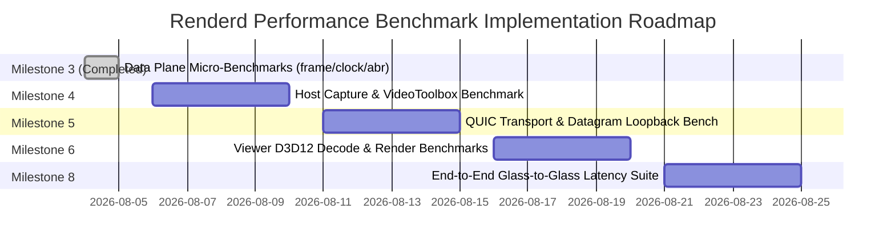

# Renderd Systems Performance & Benchmarking Roadmap

**Document Version:** 1.0.0  
**Author:** Renderd Systems Performance Engineering  
**Target Architecture:** `RFC-0002 §2.1`, `RFC-0002 §7`, `REPO-0001 §14`  

---

## 1. Executive Summary & Latency Target Budget

Renderd is designed to achieve low-latency peer-to-peer screen streaming ($\le 30 \text{ ms}$ glass-to-glass latency at 1080p60 over Gigabit LAN). To guarantee this budget across operating systems and hardware configurations, performance benchmarks monitor micro-benchmarks (CPU/memory data plane operations) and macro-benchmarks (end-to-end hardware pipeline execution).

### Target Latency Budget Breakdown (RFC-0002 §2.1)

| Pipeline Stage | Subsystem / API | Nominal Latency | Max Target Budget | Optimization Target |
|----------------|-----------------|-----------------|-------------------|---------------------|
| **1. Display Capture** | macOS ScreenCaptureKit (`SCStream`) | 3.0 ms | 5.0 ms | Zero-copy `IOSurface` binding |
| **2. Hardware Encoding** | VideoToolbox (`VTCompressionSession` H.265) | 5.0 ms | 8.0 ms | Real-time mode, no B-frames |
| **3. Network Transport** | QUIC Unordered Datagrams (`quinn`) | 4.0 ms | 8.0 ms | P2P UDP datagram socket |
| **4. Fragment Reassembly** | `renderd-frame` sliding-window buffer | 1.0 ms | 2.0 ms | Zero-allocation `Bytes` slicing |
| **5. Hardware Decoding** | Windows D3D12 Video Decode (`ID3D12VideoDecoder`) | 4.0 ms | 7.0 ms | GPU memory zero-copy decode |
| **6. Swapchain Presentation** | DXGI Swapchain (`IDXGISwapChain1`) | 2.0 ms | 4.0 ms | Allow-tearing / VRR support |
| **TOTAL GLASS-TO-GLASS** | **Complete Host $\rightarrow$ Viewer Pipeline** | **19.0 ms** | **34.0 ms** | **$\le 30.0 \text{ ms}$ @ 60 FPS Target** |

---

## 2. Key Metrics & Benchmark Strategy

Performance engineering for Renderd evaluates twelve fundamental performance dimensions across unit, subsystem, and integration layers:

| Performance Metric | Definition | Measurement Hook / Benchmark Tool |
|--------------------|------------|-----------------------------------|
| **Capture Latency** | Time from display VSYNC pulse to `CMSampleBuffer` emission in `ScreenCaptureKit` | CoreMedia frame arrival timestamp vs display refresh timestamp |
| **Encoding Latency** | Time from `CMSampleBuffer` submission to `VTCompressionSession` output callback | High-resolution `MonoInstant` delta across VideoToolbox FFI bridge |
| **Network Latency** | Time for QUIC datagram flight from Host transmit socket to Viewer receive socket | 4-timestamp NTP/PTP rolling clock estimator (`renderd-clock`) |
| **Decoding Latency** | Time from NAL unit submission to `ID3D12VideoDecoder` to output surface readiness | D3D12 timestamp query heap delta |
| **Render Latency** | Time from YUV$\rightarrow$RGB shader execution to `Present1()` execution | DXGI present latency query (`IDXGISwapChain1::GetFrameStatistics`) |
| **Glass-to-Glass Latency** | Total end-to-end delay from host frame generation to photon emission on viewer display | Optical high-speed camera / synthetic 4-timestamp clock offset calculation |
| **Memory Usage** | Resident Set Size (RSS) and heap allocations | `jemalloc` statistics / Win32 `GetProcessMemoryInfo` |
| **CPU Usage** | CPU utilization percentage across host daemon and viewer worker threads | OS thread time metrics (`procfs` / `task_info` / `GetProcessTimes`) |
| **GPU Usage** | GPU compute, copy, and video decode engine utilization | Apple Metal performance counters / Windows DXGI Adapter queries |
| **Throughput** | Effective payload transfer rate in Megabits per second (Mbps) | `renderd-net` socket bytes / second counter |
| **Packet Loss Rate** | Percentage of lost QUIC datagram fragments in 500ms telemetry window | `renderd-abr` periodic telemetry report ingestion |
| **Jitter & Frame Drops** | Inter-frame arrival variance and discarded frames due to deadline expiration | `ReassemblyBuffer` eviction metrics and `RollingStats` percentile calculations |

---

## 3. Micro-Benchmarking Suite (`criterion`)

Micro-benchmarks measure CPU-bound data plane operations in isolation.

### Currently Implemented Micro-Benchmarks:

1. **Datagram Fragment Codec (`crates/renderd-frame/benches/frame_bench.rs`):**
   - Micro-benchmarks 16-byte binary fragment header encoding and decoding.
   - Measures sliding-window reassembly buffer insertion across multi-fragment frames.

2. **Monotonic Clock Estimator (`crates/renderd-clock/benches/clock_bench.rs`):**
   - Micro-benchmarks stack-allocated `RollingStats<const N: usize>` insertion, mean, variance, and percentile calculations.
   - Measures 4-timestamp minimum-RTT clock offset calculations (`ClockEpochEstimator`).

3. **ABR State Machine (`crates/renderd-abr/benches/abr_bench.rs`):**
   - Micro-benchmarks `AbrEngine` state machine transitions (`Steady` $\rightarrow$ `ProbeUp` $\rightarrow$ `Backoff` $\rightarrow$ `Panic`) and bitrate calculations under loss.

---

## 4. Benchmark Execution Roadmap by Milestone



### Planned Benchmark Implementations:

#### Milestone 4: Host Capture & Encoder Benchmark Suite
- **Location:** `crates/renderd-host/benches/capture_encode_bench.rs`
- **Objective:** Measure `ScreenCaptureKit` frame dispatch rate and `VideoToolbox` H.265 hardware encoding latency under simulated 1080p60 and 1440p60 display loads.
- **Metrics:** Capture latency, encode latency, GPU copy overhead.

#### Milestone 5: QUIC Transport Loopback Benchmarks
- **Location:** `crates/renderd-net/benches/transport_bench.rs`
- **Objective:** Measure QUIC datagram burst throughput, packet loss simulation resistance, and socket loopback latency under 50 Mbps and 100 Mbps traffic.
- **Metrics:** Network latency, throughput, packet loss handling, socket CPU usage.

#### Milestone 6: Viewer D3D12 Decode & Render Benchmarks
- **Location:** `crates/renderd-viewer/benches/decode_render_bench.rs`
- **Objective:** Benchmark Direct3D 12 video decode queue latency and DXGI swapchain presentation timing on Windows.
- **Metrics:** Hardware decode latency, render latency, GPU memory bandwidth.

#### Milestone 8: End-to-End Glass-to-Glass Latency Harness
- **Location:** `tools/latency-bench` (CLI Macro Benchmark Extension)
- **Objective:** Orchestrate full end-to-end loopback streaming between local Host daemon and Viewer client, reporting 4-timestamp glass-to-glass latency distributions (p50, p95, p99).
- **CI Integration:** Continuous latency regression tracking via `.github/workflows/latency_regression.yml`.

---

## 5. Running Benchmarks

### Running Crate Micro-Benchmarks
```bash
cargo bench --workspace
```

### Running Latency Benchmark CLI (`latency-bench`)
```bash
# Print pipeline target budget report
cargo run --manifest-path tools/latency-bench/Cargo.toml -- budget

# Run framing codec micro-benchmark
cargo run --manifest-path tools/latency-bench/Cargo.toml -- framing --iterations 100000

# Run clock estimator micro-benchmark
cargo run --manifest-path tools/latency-bench/Cargo.toml -- clock --iterations 100000
```
